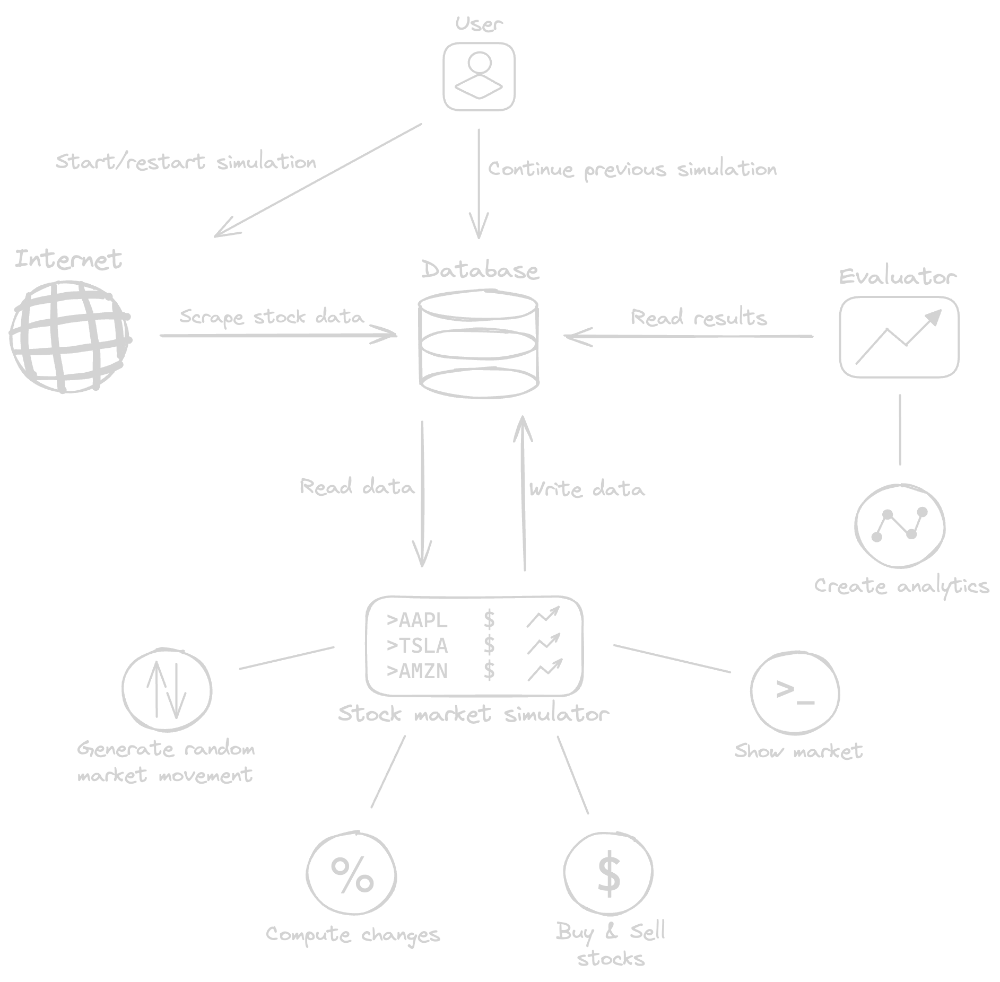

# Market-Simulator

## Intuition

This is a medium-scale student project I came up with to extend my personal portfolio, and deepen my programming and developing knowledge. There are several goals of this project:

- Create a program using C++
- Use Object Oriented Programming concepts
- Work with databases
- Learn basic web scraping
- Learn to process and analyse data
- Extend my portfolio with a non-trivial, medium-sized project

## Idea

Upon running the program, users can either start a new simulation, or continue an existing one, if there is one saved. If the user chooses to start a new simulation, the webscraper is launched, which presents current real-life data, to start the simulation with. The simulation generates random movement on the market, while users are able to buy and sell stocks. After the simulation is stopped, the data is saved in a database. Users can choose to see the analytics of the session, or to use this saved data the next time they want to start a simulation.

